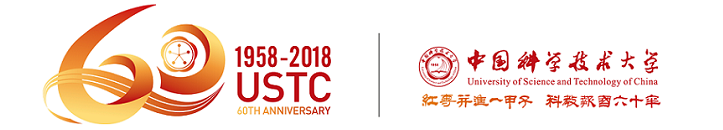

# 中国科学技术大学 ICS(H)——计算机系统概论(H) 作业&实验

这里是中国科学技术大学2025秋季学期计算机系统概论(H)的实验和作业仓库

2025秋季学期所有作业和实验均已完成，其中实验部分选做LabA(Assembler)和LabS(Simulator)二者其一，我完成了LabA。

答案仅供参考

课程主页：https://acsa.ustc.edu.cn/ics/

# University of Science and Technology of China ICS(H)——Introduction to Computing Systems(H) Homework&Labs

Here is the repository for experiments and homework of Introduction to Computing Systems(H) in USTC Fall 2025.

All experiments and homework for Fall 2025 have been completed. For the experiment part, students can choose either LabA (Assembler) or LabS (Simulator). And I completed LabA.

Answers are for reference only.

Course Homepage: https://acsa.ustc.edu.cn/ics/

