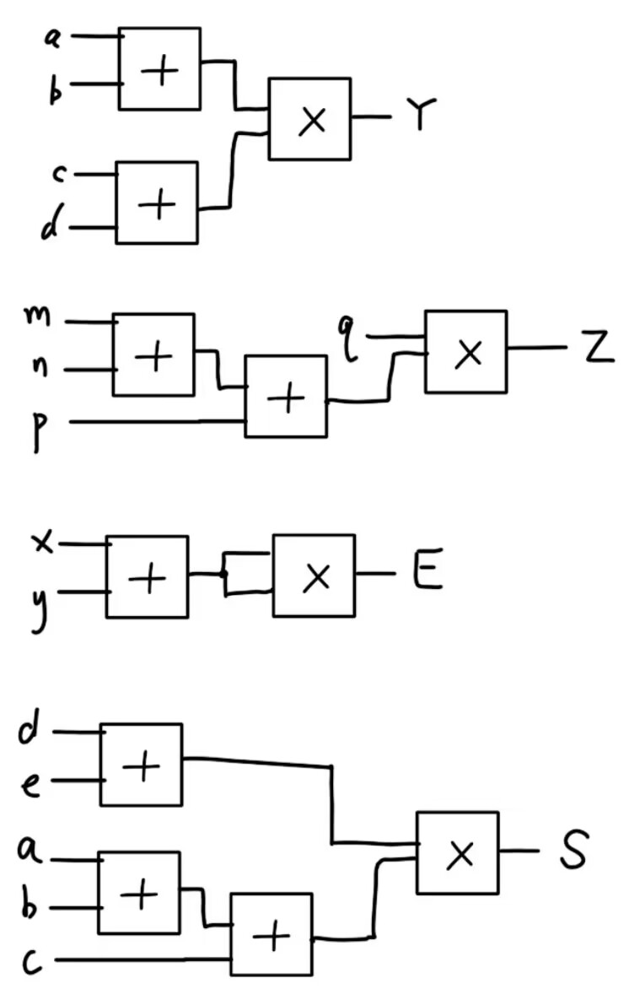

# ICS HW1


## T1
`-103 = 10011001`

`+76 = 01001100`

`00110110 = +54`

`11101101 = -19`
## T2
最大值为`127`;最小值为`-128`

最大值为$2^{N-1}-1$;最小值为$-2^{N-1}$
## T3
存在, `-64`
## T4
$$
a + b > 2^{31} - 1
$$
如果都改为`unsigned int`，结果永远都不是负数，因为永远都是 `unsigned int` 类型.
## T5
`13.0`
## T6
最小正数为`0 00000000 00000000000000000000001`
最小数为`1 11111110 11111111111111111111111`
## T7
显然, 0满足条件
## T8
```c
void swap(int* a, int* b) {
    *a = *a + *b;
    *b = *a - *b;
    *a = *a - *b;
}
```
如果在`sort`函数中使用, 可能会因为`*a + *b`溢出导致排序错误; 如果`a`和`b`指向同一个变量会导致值清零.
修正方法:使用临时变量`temp`存储值.
```c
void swap(int* a, int* b) {
    int temp = *a;
    *a = *b;
    *b = temp;
}
```
## T9
如下图所示:

## T10

A-Z与a-z一共有`52`个, 0-9有`10`个数, 两个特殊符号有`2`个数, 一共`64`个数, 使用`0-63`,即`000000-111111`表示.

- 故表示一个单独字符需要`6`bits.
- 表示一个字符串需要`6n`bits.(对于n个字符组成的字符串).
- `001000 011100 101100 110110 110100 110110 111000 111001`

