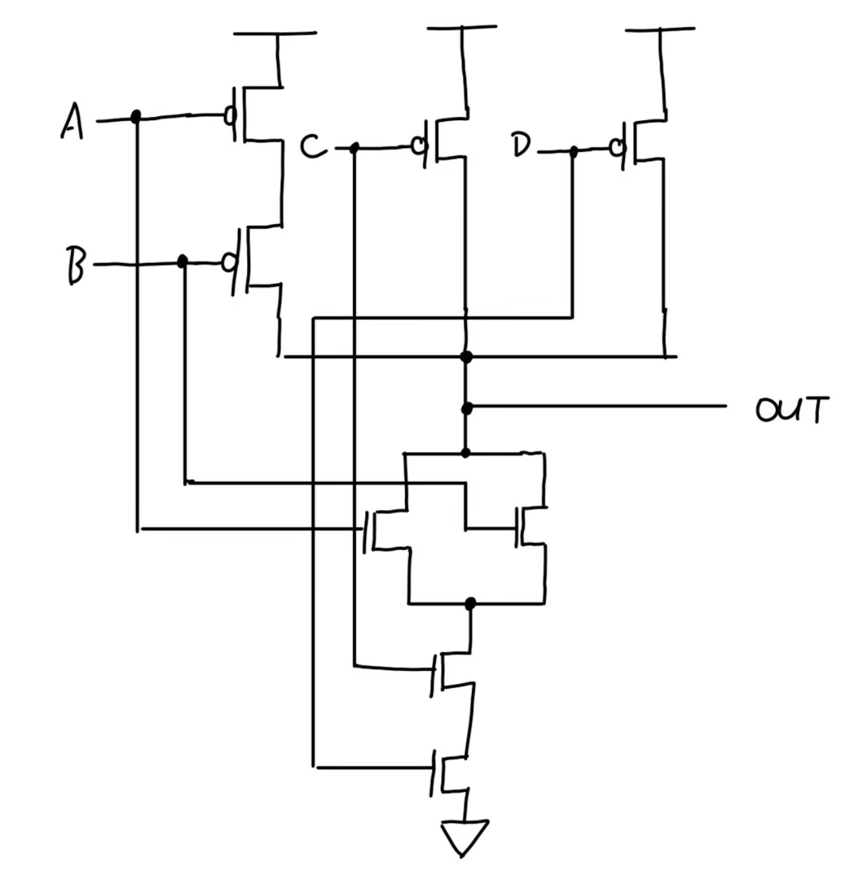
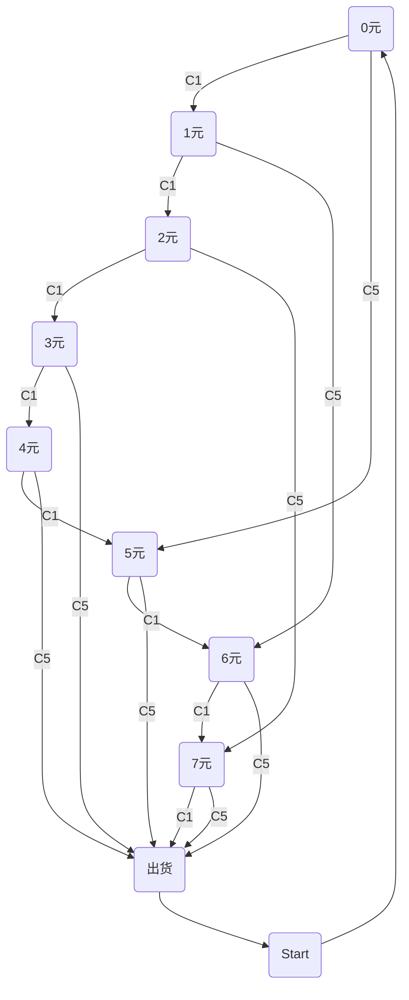

# ICS HW2

## T1
- 0 OR X = X
- 1 OR X = 1
- 0 AND X = 0
- 1 AND X = X
- 0 XOR X = X
## T2
1.
|A|B|C|Out|
| ---- | ---- | ---- | ---- |
|0|0|0|1|
|0|0|1|0|
|0|1|0|0|
|0|1|1|1|
|1|0|0|0|
|1|0|1|0|
|1|1|0|1|
|1|1|1|0|
2.

## T3

1.NOR门可以构造出NOT, AND, OR三种基本逻辑门：

- $NOT:A=\overline{A+A}=\overline{A}$
- $OR:A+B=\overline{\overline{A+B}}$
- $AND:AB = \overline{\overline{A}+\overline{B}}$

2.假设XOR门逻辑完备，则可以用XOR门实现NOT门，当A=1时XOR门可以反转A，但若A=0时，XOR门只能获取0，是故无法实现NOT门。

## T4

- 最小的规格化数为`0 00000001 00000000000000000000000` = $2^{-126}$

- 非规格化数范围是`0 00000000 00000000000000000000001`~`0 00000000 11111111111111111111111` = $2^{-149}$~$(1-2^{-23}*2^{-126})$
- 因为规格化数最小值离0还有不小距离，会导致计算精度较低。
- 在非规格化部分是均匀的，在规格化部分是不均匀的，因为指数域E的增加会导致指数性增长。

## T5

$A\ XOR\ B=\overline{\overline{\overline{A}B}\overline{A\overline{B}}}$

## T6

1.

- A[1:0]=00
- WE=1

2.

- 所有可访问的地址总数
- 每个地址最大能存储的值的位数
- 3, 4

## T7

- $-2^{15}$~$2^{15}-1$

## T8

- 运算器、控制器、存储器、输入、输出。
- 量子计算利用量子的叠加态，是一种并行的计算方法，而冯诺依曼结构是在串行运算的基础上建立的，有根本的矛盾。并且量子计算中量子比特的状态是易失的，没办法在轻松读取数据。

## T9

- 0 0 0 1 1 1
- 12
- 6
- 6

## T10

## T11

- 将8瓶酒分为0123和4567两组分两天喂给老鼠A喝，选择毒死老鼠A的那组酒再次二分并重复上述流程，最终可以锁定到杀死老鼠C的那瓶酒，也就是毒酒。
- 16瓶
- 预计会有3只老鼠死亡；可以将8瓶酒分为01、23、45、67四组分别混合喂给老鼠ABCD，毒死老鼠那2瓶酒再分别单独喂给另外两只老鼠就可以确定毒酒。这样只需要杀掉2只老鼠。

