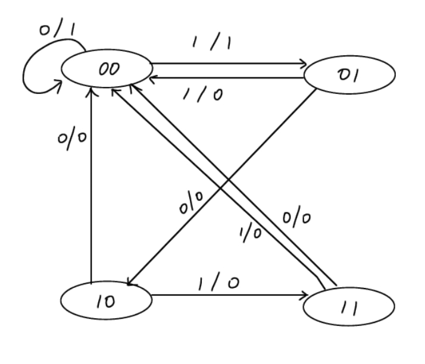

# ICS HW3

## T1
1.
| $S_1$ | $S_0$ | $X$ | $Z$ | $S_1'$ | $S_0'$ |
|-------|-------|-----|-----|--------|--------|
| 0     | 0     | 0   |  1  |   0    |   0    |
| 0     | 0     | 1   |  1  |   0    |   1    |
| 0     | 1     | 0   |  0  |   1    |   0    |
| 0     | 1     | 1   |  0  |   0    |   0    |
| 1     | 0     | 0   |  0  |   0    |   0    |
| 1     | 0     | 1   |  0  |   1    |   1    |
| 1     | 1     | 0   |  0  |   0    |   0    |
| 1     | 1     | 1   |  0  |   0    |   0    |

2.

## T2

| X          | Does the program halt? | Value stored in r0 |
|------------|------------------------|--------------------|
| 000000010  |           Yes          |         2          |
| 000000001  |           Yes          |         3          |
| 000000000  |           Yes          |         6          |
| 111111111  |            No          |         2          |
| 111111110  |           Yes          |     $-2^{15} + 4$  |

## T3
`ADD R6, R2, R6`的指令周期如下:
### Fetch 
PC自增，MAR获取最新的PC(1)，然后访问内存中下一条指令存储到MDR中(100)，然后存储到IR中(1).
### Decode
不需要访问内存(1).
### Fetch Operands
从R1和R6中分别获取Oprand，可以同时完成(1).
### Execute
使用ALU计算结果(1).
### Store Result
将结果存储到R6中(1).

综上，整个指令需要106个周期.
## T4

    1.有。减少寄存器个数之后只需要两位就可以表示所有寄存器，这样IMM可以多出一位。

    2.有。减少寄存器个数之后只需要两位就可以表示所有寄存器，这样PCoffset可以拓展到PCoffser10，可以跳转到更远的地方。

    3.无。BR指令中不需要指定寄存器，所以没有任何好处。

## T5

    (a) 至少需要8位。

    (b) 至少需要7位。

    (c) 3位。

## T6

|2|1|0|
| ---- | ---- | ---- |
|1|1|1|
|0|1|1|
|0|1|0|
|1|1|1|

`D[2:0]=111`
## T7

### Operations on Memory

| Operation No. | R/W | MAR | MDR |
| :---: | :---: | :---: | :---: |
| 1 | W | `x4000` | 11110 |
| 2 | `R`| `x4003` |`10110` |
| 3 | W | `x4001` | `10110` |
| 4 | `R`| `x4002` |`01101` |
| 5 | `W`| `x4003` |`01101` |

### Contents of Memory locations

| Address | Before Access 1 | After Access 3 | After Access 5 |
| :---: | :---: | :---: | :---: |
| x4000 | 01101 | `11110` | `11110`|
| x4001 | 11010 | `10110` | `10110`|
| x4002 | `01101` | `01101`|`01101` |
| x4003 | 10110 |`10110` | 01101 |
| x4004 | 11110 | 11110 | 11110 |

## T8

| Address | Instruction |
|---------|---------------------|
| x3000   | `1001 111 001 111111` |
| x3001   | 1001 110 010 111111 |
| x3002   | 0101 101 111 000010 |
| x3003   | `0101 100 001 000110` | 
| x3004   | 1001 001 101 111111 |
| x3005   | `1001 100 100 111111` |
| x3006   | `0101 000 001 000100` |
| x3007   | 1001 011 000 111111 |

## T9
`0000 111 000000000`可以，因为BR的PCoffset = 0.
其他都不是
## T10
BR指令能跳转的范围是有限的(`PC-256` ~ `PC + 255`)

JMP使用寄存器的值作为地址，而寄存器中的值是16位的，可以跳转到任何地方。

```
LEA R3, LABEL
JMP R3
```
