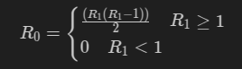

# ICS HW4

## T1
- LDR   Fetch->Execute 2次.
- STI   Fetch->Execute(R)->Execute(W) 3次.
- TRAP  Fetch->Execute 2次.
## T2
- AND `AND R0, R0, 0 00000`.
- ADD `ADD R0, R0, 1 00000`.
- BR`BR 000 000000000`.
## T3
- PC相对寻址模式: LD, ST, LEA.      操作数在寄存器和指令中.
- 间接寻址模式: LDI, STI.           操作数在指令和寄存器中.
- 基址+偏移量寻址模式: LDR, STR.     操作数在寄存器和指令中
- 立即数寻址模式: AND, ADD.         操作数在指令或寄存器中.
## T4
- 相同点：都会改变PC的值使得程序跳转的新的地址执行
- 不同点：所用的指令不一样，BR是分支指令，JSR是调用子程序指令，而且跳转范围不一样。
## T5
PC相对寻址的寻址范围是`PC + min{PCoffset}`~`PC + max{PCoffset}`.
## T6
- R0 = x0000.
- R1 = xD000.
- R1 = x2002.
- R3 = x3002.
## T7
顺序结构:
```
// 初始化R1, R2
AND R1, R1, #0
AND R2, R2, #1

// 计算F(3)并更新R1和R2
ADD R3, R1, R2
ADD R1, R2, #0
ADD R2, R3, #0

// 计算F(4)并更新R1和R2
ADD R3, R1, R2
ADD R1, R2, #0
ADD R2, R3, #0

//计算F(5)
Add R3, R1, R2
```
循环结构:
```
.ORIG 0x3000
// 初始化
AND R1, R1, #0
AND R2, R2, #0

ADD R4, R4, #8

// 循环结构
LOOP
    ADD R3, R1, R2
    ADD R1, R2, #0
    ADD R2, R3, #0
    ADD R4, R4, #-1
    BRp LOOP

HALT

.END
```
## T8
(2) `1001 101 010 111111`

(4) `1001 011 110 111111`
## T9
表示BR指令是否需要执行跳转.
## T10
$$
R_0 = 
\begin{cases}
\frac{(R_1(R_1 - 1))}{2}   \quad R_1 \geq 1\\
0 \quad R_1 < 1
\end{cases}
$$
