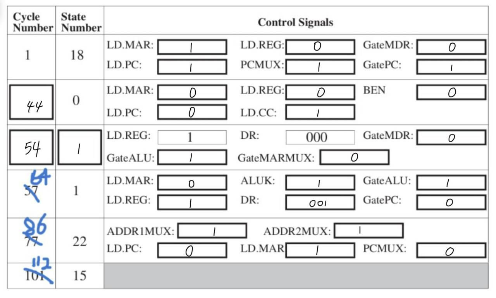

# ICS HW5

## T1

### 问题
- 执行完`TRAP x22`之后会出现未定义行为.
- `TRAP x23`会从键盘读取一个字符，但是`LEA R0, MESSAGE`会覆盖这个字符，无效操作.
### 解决方法
1.在`TRAP x22`和`MESSAGE .STRINGZ "Program reporting"`之间添加一条`TRAP x25`.
2.在`TRAP x22`之后添加一个`BR`指令，跳转到`HALT`.
```
        LEA R0, MESSAGE
        TRAP x22        ; PUTS
        BRnzp DONE      ; Go to DONE
MESSAGE .STRINGZ "Program reporting"
DONE    TRAP x25        ;
```
## T2
(1)因为`HALT`其实是`TRAP 0x25`，`PC`会跳转到操作系统`HALT`例程中，而这个过程会操作寄存器并修改其中的值，所以会导致结果和预期不符。

(2)会。让`PC`在`HALT`例程中不断循环，实现停机的效果。
## T3
- 触发方式不同：`TRAP`是由指令自主触发，而中断是硬件或者外设触发的。
- 用途不同：中断用于响应外部事件，比如键盘的输入，`TRAP`则共程序主动调用。
- 时序不同：`TRAP`和时钟周期是对齐的，而中断则不是，也就是异步的。
## T4
(1) 系统空间是用来存储操作系统的空间，包括系统文件和系统程序等数据。

(2) 用户空间是分配给用户的空间，用来存放和运行用户的程序和数据等。

(3) 用户模式不可访问系统空间。

(4) `ACV`是`Access Control Violation`，当程序访问无法访问的地址的时候就会触发。

(5) 虚拟地址有效；有对应权限；是否有特权。

(6) `TRAP`、外部中断、异常。
## T5
- 假设地址开局为x3000
        - A: x3000，B: x3002，C: x3008，D: x300A，E: x300C，F: x300D

- 执行步骤：
        (1) x3000: `LD R0, E` → R0 = x23F3

        (2) x3001: `LEA R7, E` → R7 = x300C

        (3) x3003: `ADD R2, R0, #0` → R2 = x23F3

        (4) x3004: `LD R1, D` → R1 = x0021

        (5) x3005: `LD R3, B` → R3 = x1021

        (6) x3006: `ADD R3, R1, R3` → R3 = x1042

        (7) x3007: `ST R3, C` → MEM[x3008] = x1042

        (8) x3009: `RET` → 跳到 R7(=x300C)

        (9) x300C: `LD R1, A` → R1 = MEM[A] = 0010 000 000001011 = x200B

        (10) x300D: `ADD R0, R0, R1` → R0 = x23F3 + x200B = x43FE

- 综上，R0 = x43FE

## T6
| 周期   | 状态 | 总线   | 该周期的重要控制信号                                      |
|--------|------|------|------------------------------------------------------|
| T      | 18   | x3010| LD.MAR=1, LD.PC=1, PCMux=PC+1, GatePC=1              |
| T+4    | 35   | xA202|       LD.IR, GateMDR=1, LD.MDR=1                     |
| T+6    | 2    | x3013|LD.MAR=1, LD.IR=1, ADDR1MUX, ADDR2MUX=SEXT[8:0], GateMARMUX=1                                               |
| T+10   | 35   | x4567|     GateMDR=1, LD.MDR=1, LD.MAR=1                                                 |
| T+14   | 1    | x0000|LD.REG=1, DR=001, LD.CC=1, GateMDR=1                                                      |


(1) 如上表所示.

(2)正在处理`LDI R1, PCoffset`，其中`PCoffset`=`000000010`.

(3) 在`x3010`.

(4) 需要`4`个时钟周期.

(5) `[x3010]` = `xA202`
    `[x3013]` = `x4567`
    `[x4567]` = `x0000`
    
## T7
填写如下:
```assembly
        .ORIG x3000
        LD R0, A               
        LD R1, B
AGAIN   BRz DONE                
        ADD R0, R0, R0
        ADD R1, R1, #-1                       
        BRnzp AGAIN
DONE    ST R0, A                
        HALT                    
A       .FILL x0C00
B       .FILL x0001
        .END
```
表格如下:

计算`A*(B+1)`的值.
## T8

```assembly
ADD R2, R0, #0
LDR R0, R2, #1
TRAP x21
LDR Ro, R2, #1
LDR R1, R0, #1
STR R1, R2, #1
LDR R0, R0, #0
STR R0, R2, #1
RET
```
