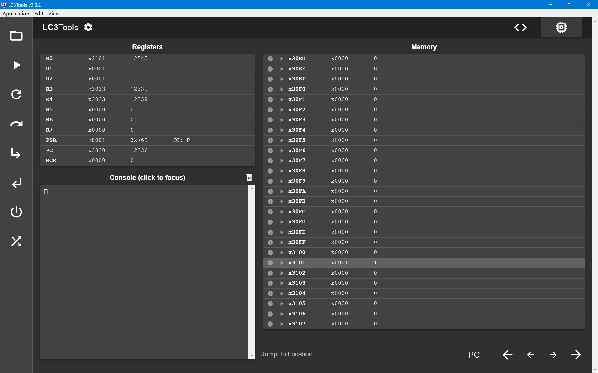
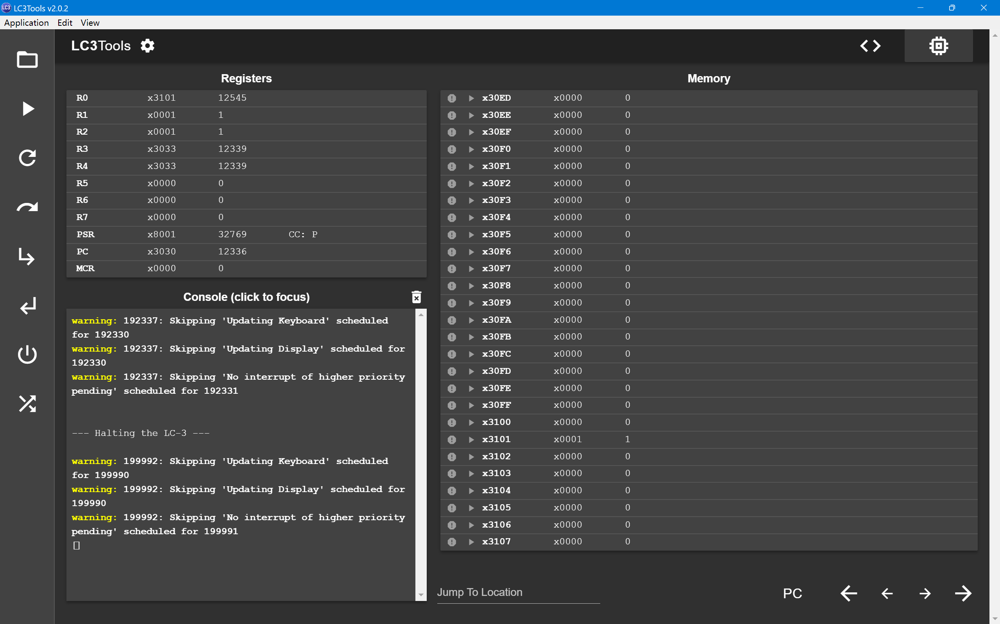
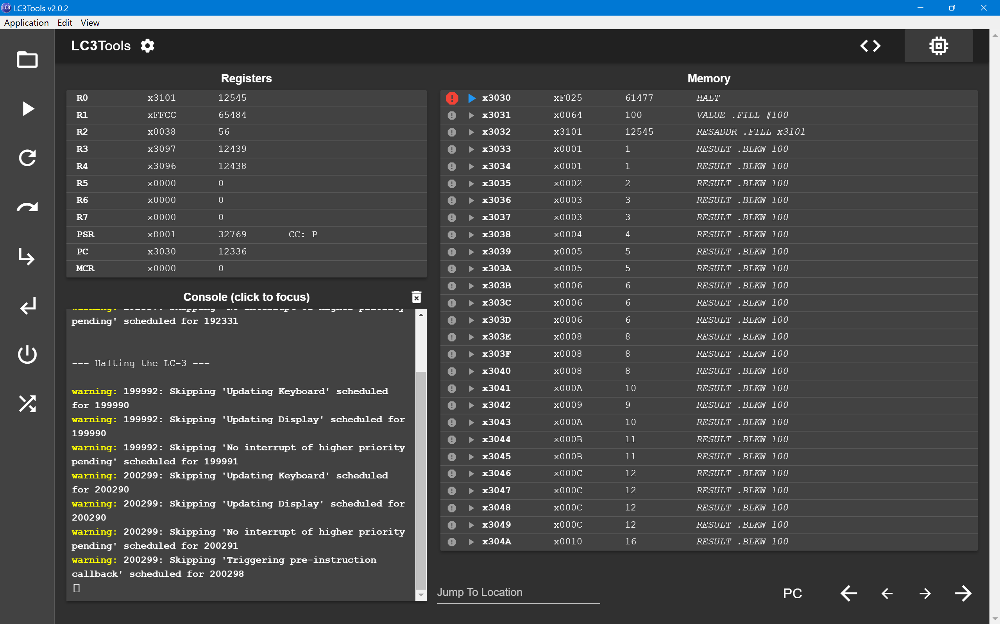
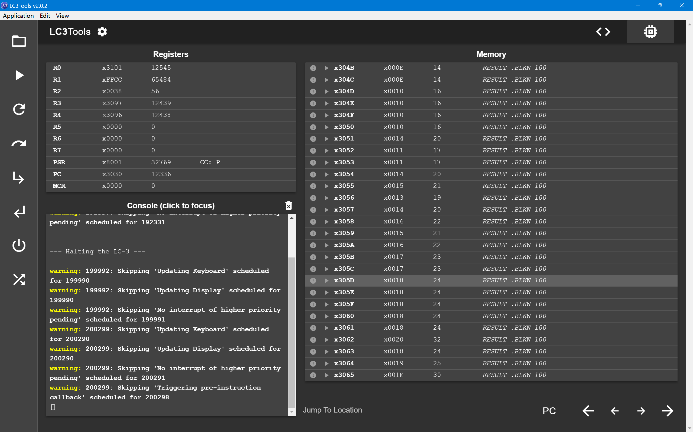
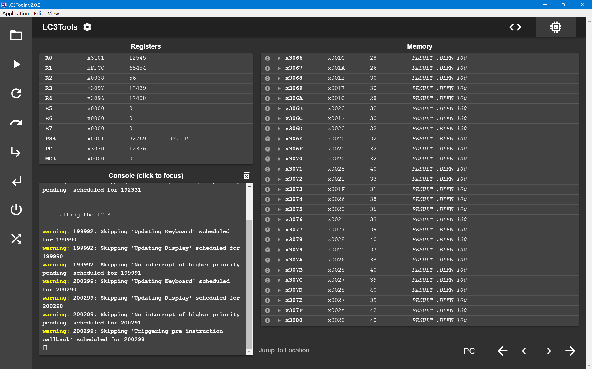
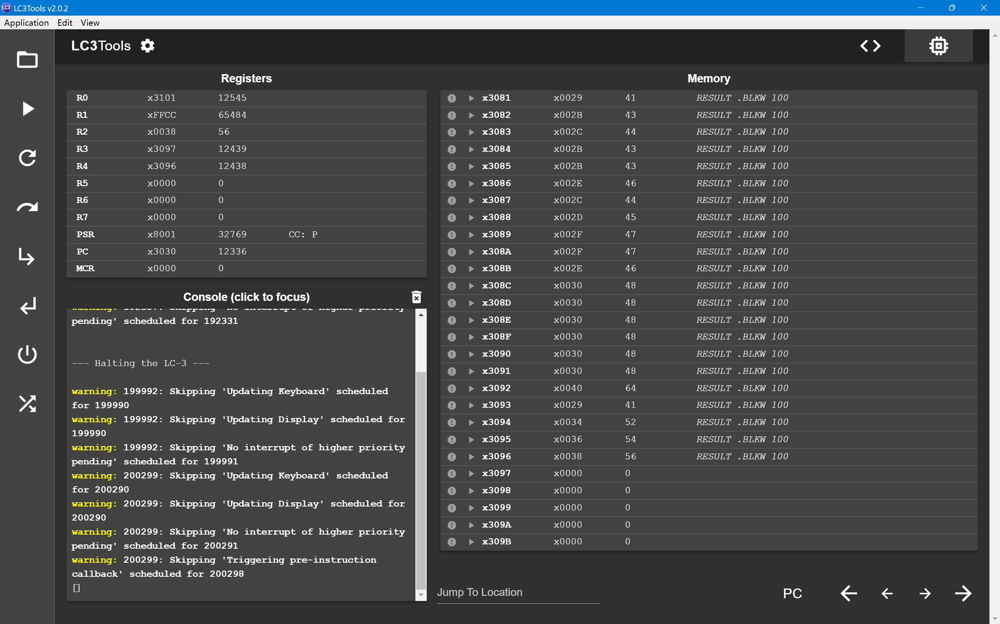
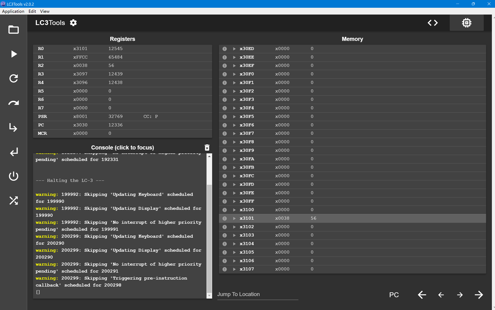
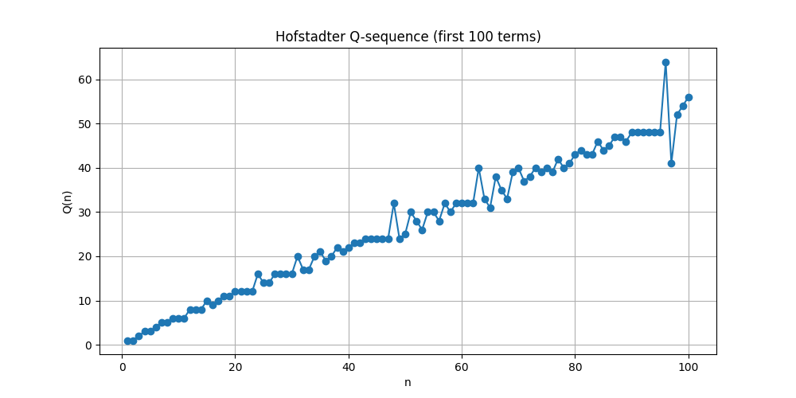

# ICS Lab2

## Assembly Code

```assembly
        .ORIG x3000

        AND R0, R0, #0      ; Clear R0
        AND R4, R4, #0
        LD  R0, VALUE    ; Load N into R0

        LEA R3, RESULT     ; R3 = &RESULT[0]
        
        AND R1, R1, #0
        ADD R4, R3, #0      ; R4 = &RESULT[0] base address
        ADD R1, R1, #1      ; R1 = 1
        STR R1, R4, #0      ; RESULT[0] = 1
        STR R1, R4, #1      ; RESULT[1] = 1

        ADD R0, R0, #-2     ; R0 = N - 2
        BRnz SKIP   ; If N <= 2, skip the loop

        AND R1, R1, #0      ; Clear R1 as q
        AND R2, R2, #0      ; Clear R2 as v
        AND R4, R4, #0      ; Clear R4 as t
        AND R0, R0, #0      ; Clear R0 to store i as iterator
        LD R0, VALUE        ; Load N into R0
        ADD R3, R3, R0      ; R3 = RESULT[N]

        ADD R0, R0, #-2     ; R0 = N - 2, then BRn so that we loop N-2 times
        NOT R0, R0
        ADD R0, R0, #1      ; set R0 = -(N - 2) as LOOP counter (better for get value in RESULT)
                            ; LDR Rx, R3, Ry  ; Load RESULT[[Ry]]] into Rx
        

LOOP    BRz DONE
        AND R2, R2, #0      ; Clear R2 for v storage


STEP1   ADD R4, R0, #-1     ; t1 = i - 1
        ADD R4, R3, R4      ; Calculate address for Q(i - 1)
        LDR R1, R4, #0      ; q1 = Q(i - 1)

        NOT R1, R1          
        ADD R1, R1, #1      ; R1 = -q1
        ADD R4, R0, R1      ; R4 = t1 = i - q1
        
        ADD R4, R3, R4      ; Calculate address for Q(t1)
        LDR R4, R4, #0      ; R4 = Q(t1)

        ADD R2, R2, R4      ; R2 += v1


STEP2   ADD R4, R0, #-2     ; t2 = i - 2
        ADD R4, R3, R4      ; Calculate address for Q(i - 2)
        LDR R1, R4, #0      ; q2 = Q(i - 2)

        NOT R1, R1
        ADD R1, R1, #1      ; R1 = -q2
        ADD R4, R0, R1      ; R4 = t = i - q2

        ADD R4, R3, R4      ; Calculate address for Q(t2)
        LDR R4, R4, #0      ; R4 = Q(t2)

        ADD R2, R2, R4      ; R2 += v2  now we have v1 + v2 in R2


STEP3   ADD R4, R3, R0      ; Calculate address for Q(i)
        STR R2, R4, #0      ; Store v into Q(i)
        ADD R0, R0, #1     ; i = i + 1
        BRnzp LOOP

SKIP    AND R2, R2, #0      ; Clear R2
        ADD R2, R2, #1      ; If N <= 2, set result to 1

DONE    LD R0, RESADDR      ; R0 = Result Address
        STR R2, R0, #0      ; Store final value into x3101
        HALT

VALUE   .FILL #100  ; N value
RESADDR .FILL x3101     ; Result Address
RESULT  .BLKW 100   ; Reserve space for the Q[1...N] results
        .END
```
## Description
I initialize memory for results using `.BLKW 100` and set `Q(1)` and `Q(2)` as `1`, then iteratively computes `Q(i)` for `i ≥ 3` using values from previous results. `LC-3` cannot directly store value into memory so I first put the target address into `R4` and use `STR` to store `Q(i)` into `results[i - 1]`. After `N - 2` loops we will complete all the results table and finally put `Q(N)` into `x3101`.
## Tests
### N = 1

### N = 2

### N >= 3
`Q(1)~Q(100)` are as follows:




And address `x3101` is also filled with `Q(100)` correctly:

## Overflow Consideration
Using Python to draw image:

We can see that the growth rate of the Hofstadter sequence is very low and close to linear. So, when `N` is small, there is actually no need to consider overflow. When `N` is large, we can take modulus operation for the result (such as `%32767`).
## Challenges
- It took me a while to figure out how to complete the iteration and search for the target address using only register `R0`.