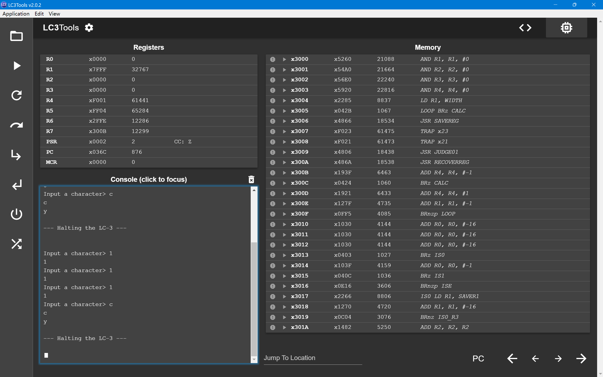
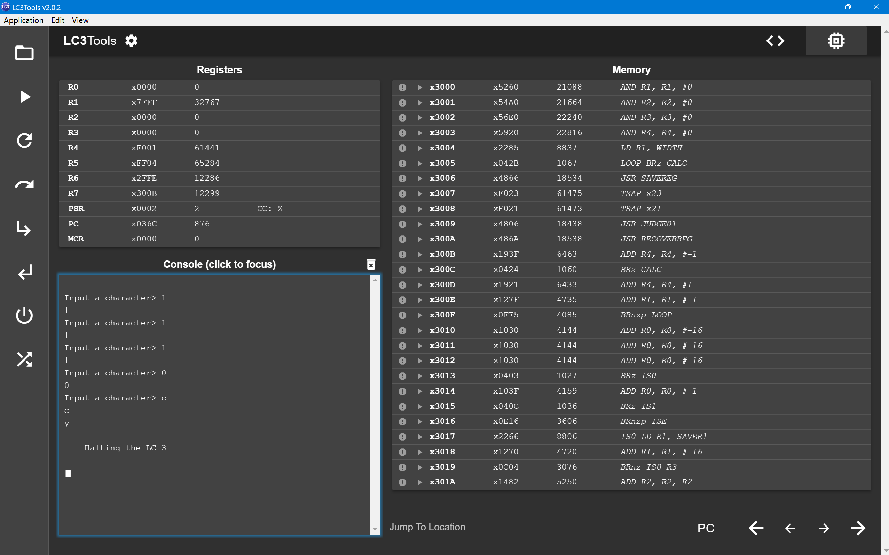
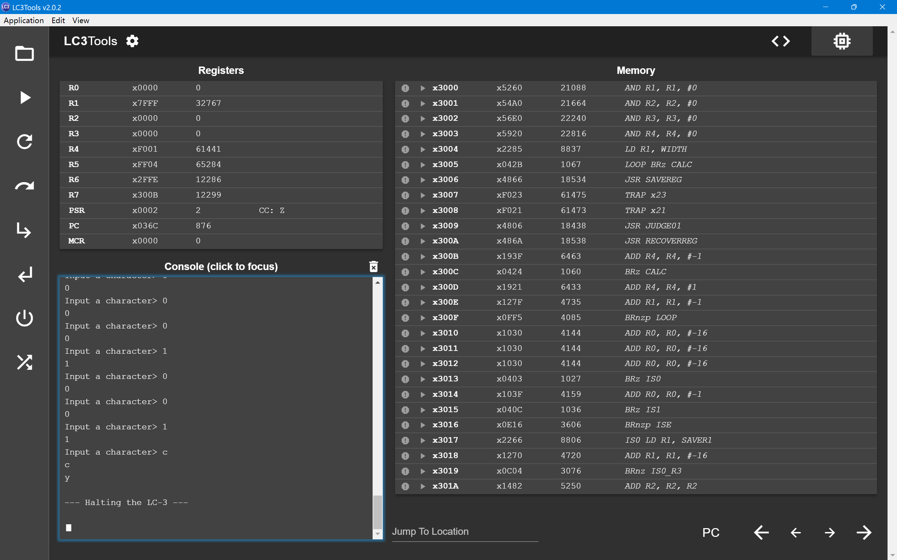
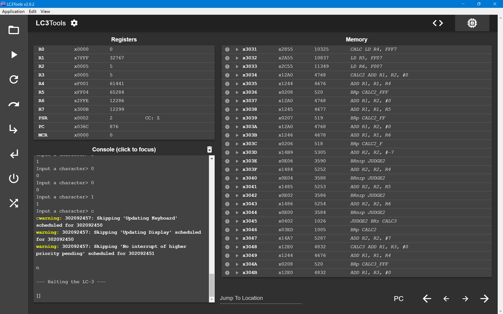

# ICS Lab3

## Assembly Code

```assembly
        .ORIG x3000

        AND R1, R1, #0
        AND R2, R2, #0
        AND R3, R3, #0
        AND R4, R4, #0        ; R4作标志位判断是否结束输入并进入CALC
        LD R1, WIDTH          ; R1存放当前位宽

LOOP    BRz CALC              ; 位宽为0则结束输入，开始计算

        ; 读取01输入并存放到R2中

        JSR SAVEREG
        TRAP x23              ; 读取输入到R0
        TRAP x21              ; 回显输入
        JSR JUDGE01           ; 判断输入是0还是1，存放到R2/R3中
        JSR RECOVERREG
        
        ADD R4, R4, #-1         ; 判断是否需要提前进入CALC
        BRz CALC                ; 如果R4 = 1则直接进入CLAC
        ADD R4, R4, #1          ; 否则恢复R4

        ADD R1, R1, #-1
        BRnzp LOOP

JUDGE01                         ; 检查输入是01还是非01, 需要对R0中的值判断(读键盘存到R0, 回显也是先到R0)
        ADD R0, R0, #-16
        ADD R0, R0, #-16
        ADD R0, R0, #-16        ; ASCII '0' = d48, 减去48就得到1/0 1 bit 输入
        BRz IS0                 ; 如果输入0, 则跳转到IS0
        ADD R0, R0, #-1         ; 如果输入1, 则跳转到IS1
        BRz IS1
        BRnzp ISE               ; 否则将R4置为1, 表示需要提前进入CALC
        
IS0     LD R1, SAVER1           ; 判断R0是否达到16, 如果小于等于16说明得存到R3里面
        ADD R1, R1, #-16
        BRnz IS0_R3
        ; 否则存到R2
        ADD R2, R2, R2
        ADD R2, R2, #0
        ST R2, SAVER2
        RET
        
IS0_R3  ADD R3, R3, R3
        ADD R3, R3, #0
        ST R3, SAVER3
        RET
        
IS1     LD R1, SAVER1
        ADD R1, R1, #-16
        BRnz IS1_R3
        ; 否则存到R2
        ADD R2, R2, R2
        ADD R2, R2, #1
        ST R2, SAVER2
        RET
        
IS1_R3  ADD R3, R3, R3
        ADD R3, R3, #1
        ST R3, SAVER3
        RET

ISE     AND R4, R4, #0
        ADD R4, R4, #1
        ST R4, SAVER4
        RET

; 开始计算是否为7的倍数, 即计算R3 * 2^16 + R2 是否为7的倍数, R2直接处理, R3根据公式
; 2^16 mod 7 = 2, 所以 R3 * 2^16 mod 7 = (2 * (R3 mod 7)) (mod 7) 这样只需要分别计算R2 R3 mod 7
CALC    LD R4, FFF7             ; 保存-7倍数序列
        LD R5, FF07
        LD R6, F007

CALC2   ADD R1, R2, #0          ; 保存R2到R1
        ADD R1, R1, R4          ; 如果R2 > x0FFF, 则减去-4095
        BRp CALC2_FFF

        ADD R1, R2, #0
        ADD R1, R1, R5          ; 如果R2 > x0FF, 则减去-252
        BRp CALC2_FF

        ADD R1, R2, #0
        ADD R1, R1, R6          ; 如果R2 > x0F, 则减去-14
        BRp CALC2_F

        ADD R2, R2, #-7         ; 如果都不是则减去7
        BRnzp JUDGE2

CALC2_FFF
        ADD R2, R2, R4          
        BRnzp JUDGE2
CALC2_FF
        ADD R2, R2, R5          
        BRnzp JUDGE2
CALC2_F
        ADD R2, R2, R6          
        BRnzp JUDGE2

JUDGE2  BRz CALC3
        BRp CALC2
        ADD R2, R2, #7          ; 此时R2中存放R2 mod 7


CALC3   ADD R1, R3, #0          ; 保存R3到R1
        ADD R1, R1, R4          ; 如果R3 > x0FFF, 则减去-4095
        BRp CALC3_FFF

        ADD R1, R3, #0
        ADD R1, R1, R5          ; 如果R3 > x0FF, 则减去-252
        BRp CALC3_FF

        ADD R1, R3, #0
        ADD R1, R1, R6          ; 如果R3 > x0F, 则减去-14
        BRp CALC3_F

        ADD R3, R3, #-7         ; 如果都不是则减去7
        BRnzp JUDGE3

CALC3_FFF
        ADD R3, R3, R4          
        BRnzp JUDGE3
CALC3_FF
        ADD R3, R3, R5          
        BRnzp JUDGE3
CALC3_F
        ADD R3, R3, R6          
        BRnzp JUDGE3

JUDGE3  BRz CALCF
        BRp CALC3
        ADD R3, R3, #7          ; 此时R3中存放R2 mod 7


        ; 计算最终结果
CALCF   ADD R3, R3, R3          ; R3 = 2 * (R3 mod 7)
        ADD R3, R3, R2          ; R3 = R3 + R2

LAST    ADD R3, R3, #-7
        BRp LAST
        ADD R3, R3, #7          ; 此时R3中存放最终结果 mod 7

        BRz ISMUL7
        BRnzp ISNOTMUL7

ISMUL7  LD R0, NEWLINE
        TRAP x21
        LD R0, CHAR_Y
        TRAP x21
        HALT

ISNOTMUL7
        LD R0, NEWLINE
        TRAP x21
        LD R0, CHAR_N
        TRAP x21
        HALT
; 保存寄存器
SAVEREG
        ST R0, SAVER0
        ST R1, SAVER1
        ST R2, SAVER2
        ST R3, SAVER3
        ST R4, SAVER4
        ST R5, SAVER5
        ST R6, SAVER6
        RET

; 恢复寄存器
RECOVERREG
        LD R0, SAVER0
        LD R1, SAVER1
        LD R2, SAVER2
        LD R3, SAVER3
        LD R4, SAVER4
        LD R5, SAVER5
        LD R6, SAVER6
        RET

; 数据存储区
SAVER0  .FILL x0000
SAVER1  .FILL x0000
SAVER2  .FILL x0000
SAVER3  .FILL x0000
SAVER4  .FILL x0000
SAVER5  .FILL x0000
SAVER6  .FILL x0000
CHAR_N  .FILL #110
CHAR_Y  .FILL #121
NEWLINE .FILL #10
FFF7    .FILL #-4095
FF07    .FILL #-252
F007    .FILL #-14
WIDTH   .FILL #32        ; 位宽
        .END
```
## Description
本程序通过输入32位二进制数判断其是否为7的倍数，如果是则输出`y`，否则输出`n`。
输入部分将二进制数分为`高16位`和`低16位`分别存入`R3`和`R2`。

利用模运算：$2^{16} \bmod 7 = 2$，因此 $R3 \times 2^{16} + R2 \bmod 7 = (2 \times (R3 \bmod 7) + R2 \bmod 7) \bmod 7$。所以只需分别对`R2`和`R3`取模再按公式合并，即可大幅简化设计。

反复`-7`效率较低，因此考虑将寄存器中的值视为`16`进制数，再分段设置`b`序列：小于`xF000`的最大`7`的倍数是`-4095`；小于`x0F00`的最大`7`的倍数是`-252`；小于`x00F0`的最大`7`的倍数是`-14`；小于`x000F`直接`-7`即可。

最终将结果输出为`y`或`n`，表示是否为`7`的倍数。
## Tests
### Input = 7

### Input = 14

### Input = 777

### Input = 1545

### Input = xFFFF
