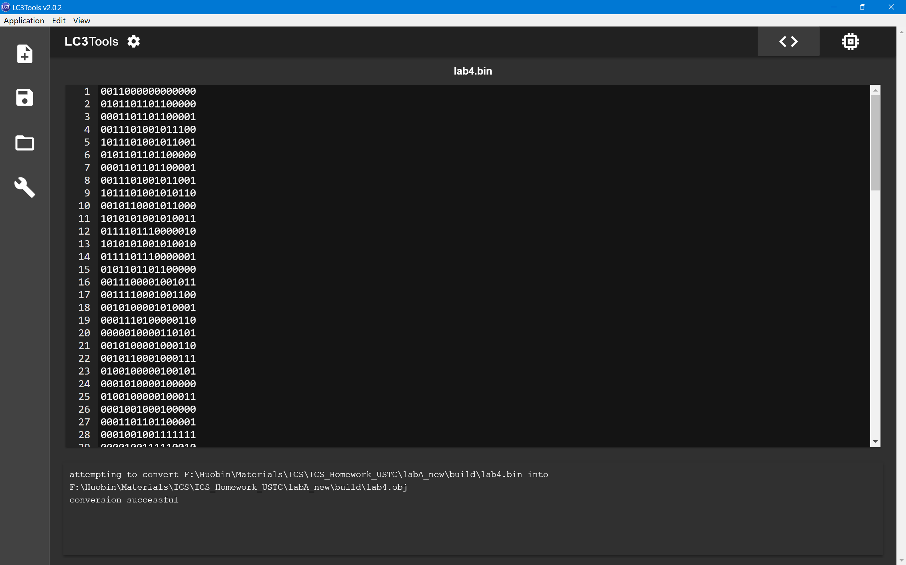

# ICS LabA

## Overview

This experiment implemented a simple **LC-3** assembler, which takes **.asm** format **LC-3** assembly code as input and translates it into text-format binary machine code.

The experiment chose to build the core logic of the assembler **from scratch** using **C++**, based on the instruction set of **LC-3** assembly language, and converted the assembly code into machine code according to the classic principle of assemblers, that is, **Two-Pass Scanning**.

## Environment & Building System
- **Programming Language**: C++
- **Building System**: Cmake
## System Structure

This assembler is based on **Tow-Pass Scanning**. We will first do **first pass** to build the symbol table and calculate addresses for each single instruction, and then do **second pass** to translate the assembly instructions into machine code using the symbol table we built before.

To implement this, I designed the following modules:
- **Formatter**: Reads the input raw assembly file and removes comments and unnecessary spaces, empty lines and tabs, and make each commas has space both sides so that we can easily tokenize later. After that, it outputs a formatted assembly file.
- **Tokenizer**: Reads the formatted assembly file and tokenizes each line into a sequence of tokens, for each token, it will have a type, value and original string.
- **Parser**: Implements the core logic of the assembler, including the two-pass scanning algorithm. In the first pass it calculates the address for each instruction and builds a symbol table, in the second pass it translates each instruction into machine code based on the symbol table and instruction sequence. It also handles possible syntax errors and semantic errors and reports them in terminal.
- **Main Program**: The entry of the assembler, which handles command line arguments, based on CLI11 library, and invokes other modules.

### Flowchart


## Description of Implementation
### Formatting
Read the source code file, remove comments, empty lines and extra spaces and tabs, and ensure that all the commas have spaces on both sides for easier analysis later.
### Tokenization
Use `std::ifstream` to read the formatted assembly file line by line. For each line, split it into tokens, because the formatted file has definetely spaces between tokens so we can simply use `<<` operator to read each token. For each token, we will set its type, value based on its string value. For example, we set token `R0` with type `REG` and value `0`. For each line, we will add an extra `EOL` token at the back of the token sequence meaning the end of line. Of course, we won't add `EOL` token for those lines with only one label token. 

Now we have a robust tokens sequence for the next step, we can simply collect one instruction by reading tokens until an `EOL` appears.
### First Pass
Now we are getting into the core logic of the assembler. In the first pass, we will read the tokens sequence and calculate the address for each instruction, and set address for each label. Because we already know all needed information in tokens of each instruction, so it is easy to collect the instruction sequence. Most of **Opcode** and **Pseudos** are easy to handle, but specially, `.BLKW` and `.STRINGZ` need more than one address space, for these two pseudos we implement extra special logic to set their addresses correctly. So I added two `bool` flags for them: `blkwMode` and `stringzMode`, when meetting them the flag will be set to true and invokes special modules to handle their addresses and then set the flag to false. You can see it in `Parser::firstPass`.
### Second Pass
This pass is much more easier than the first pass, because almost all the instrcution can be translated into machine code directly. Just make a mapping table for each part of a instruction and convert into binary machine code. For example, the token `R3` has value `3` in its `value_` member, all we need to do is just put `011` in right place of the machine code. The only a bit more complex part is to calculate the **PCoffset value**. If we have labels in the operands we must search for the symbol table and calculate the offset value then put them into the end of the instruction. The general formula is:
```math
Offset = targetAddress - pc - 1
```
And we must check each offset whether is in the valid range. For example, `BR` has PCoffset9, so the range is -256 to 255. When this error occurs, the user will get an error in terminal. You can see it in `Parser::secondPass` and `Parser::toMachineCode`.
### Output
For now, we have got the full machine code sequence in memory, I originally planned to convert them directly into `.obj` binary file, however, I could not find the proper file format for **LC-3 Tools**, I asked for a teaching assistant and he suggested that just output the machine code in text binary format is okay. So I simply output the machine code sequence into `.bin` file and then use LC-3 Tools to load and run it.

### CLI
I use **CLI11** library to implement a simple command line interface. I just download the `CLI11.hpp` file and put it into my `include/` folder, add `target_include_directories(assembler PUBLIC include)` in `CMakeLists.txt` and include it in my `main.cpp`.

## Usage
I have implemented a simple CLI interface using CLI11 library. You can use the following command to run the assembler:
```bash
./lc3-assembler -i <input_file.asm> -o <output_file.bin>
```

Here is an example:
```bash
./lc3-assembler -i lab4.asm -o lab4.bin
```
## Testing
I use the assembly code that I wrote for lab4 with my assembler, and successfully generated the right machine code the same as the one generated by LC-3 Tools. I carefully compared the two machine code line by line and confirmed that they are exactely the same. And the program can be loaded and run correctly in LC-3 Tools and got the same results.

- lab4.asm (the assembly code I wrote for lab4):

- lab4.bin (generated by my assembler)


## Conclusion
This experiment implemented a simple LC-3 assembler using C++ from scratch. It successfully assembled LC-3 assembly code into machine code using the two-pass scanning method. Through this experiment, I gained a deeper understanding of the assembler's working process and the LC-3 instruction set.

## Weaknesses and Possible Improvements
- **Error Handling**: For now, I have implemented some basic error handling, but for some edge cases I definetely didn't cover them all! And there is possible that my assembler will ignore some hidden errors... That might cause unexpected wrong machine code. I can improve this by adding more logs and checks in the parser.
- **Linking Missing**: My assembler can only handle one single assembly file, it can't link more than one assembly files together. I learnt assemblers in real world have linking ability and it is much more complex than what I implemented. Maybe I can try to implement a simple linker for my assembler in the future.
- **Output Format**: For now, my assembler cannot output `.obj` binary file directly, the main reason is that I couldn't find the proper file format for LC-3 Tools. Maybe I can try to research the source code of LC-3 Tools and improve my assembler.

## Third-Party Library
- [CLI11](https://github.com/CLIUtils/CLI11)